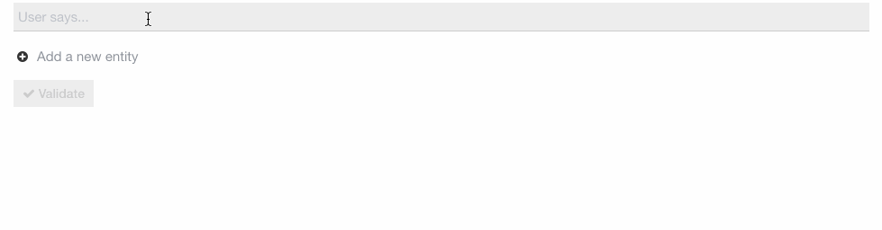

# Chatops 101

## with opsdroid

Note:
Preguntar gente en la sala chatops, montado, opsdroid.

-> Antes de explicar que son estos palabros me presento.

---

## Hello! 👋

I am Àngel, a.k.a. [@anxodio](https://twitter.com/anxodio)

_Python Developer / Data Engineer at [@HolaluzEng](https://twitter.com/holaluzeng)_

Note:
Desarrolador de Python orientado a datos.
Comercializadora eléctrica que busca conectar a las personas con al energia verde.
Energia 100% renovable y fuerte apuesta por el autoconsumo.

-> Vamos al primer palabro

---

## What the f#!@ is chatops?

> ChatOps is the use of chat clients, chat-bots and real-time communication tools to facilitate how software development and operation tasks are communicated and executed.

_Abhinav Jain, works at Accenture and sometimes answers questions like this on Quora._

<!-- .element: class="small-text" -->

Note:
Que quiere decir Chatops? Es la conjunción de Chat y Operaciones, y lo que hace
es integrar procesos de desarrollo y operaciones en las herramientas de chat del equipo.
Dicho de otra forma, se materializa en la integración de un robot en Slack (o similar)
que colabora con el equipo y puede hacer deploys, reiniciar cosas, hacer backups,
levantar máquinas... hasta donde nos llegue la imaginación.

-> Tenemos el primer palabro, nos falta el siguiente.

---

## So here is opsdroid


Opsdroid is an open source ChatOps bot framework with the moto:
**Automate boring things!**

Note:
-> Hay muchos más, entonces por que Opsdroid?

---

## But why Opsdroid?

**Simple**: Easy to install, configure and deploy.

<!-- .element: class="fragment fade-in-then-semi-out" -->

**Powerful**: Works out of the box with Slack, Telegram, Facebook… and with various NLU platforms.

<!-- .element: class="fragment fade-in-then-semi-out" -->

**Extensible**: Add your custom skills in few Python lines.

<!-- .element: class="fragment fade-in-then-semi-out" -->

Note:
Simple: docker, o simple pip install, un solo yaml de config
Potente: se conecta con muchos servicios (baterias incluidas)
Extensible: adaptarlo a nuestro caso de uso de forma sencilla

-> Y esto como?

---

## Show me more

### Let's see how Opdroid works

Note:
Vamos a entrar un poco en como funciona.
El objetivo de la charla no es explicarlo todo en profundidad, sino
dar unas pinceladas sobre su diseño y uso para que veais lo simple
que es, os entre el gusanillo y luego en casa os acabeis de mirar la documentación
y en una hora tengais un bot de prueba funcionando.
(Los que ya conoceis Chatops, ver otra herramienta que podeis usar)

-> Para ello vamos a hablar de las diferentes piezas que lo componen

---

## Skills

Skills are modules which define what actions opsdroid should perform based on different chat messages.

They’re modular and can be shared as plugins between differents opsdroid instances.

Note:
Las skills son el "qué" hace.
Algunas oficiales ya hechas que se pueden usar: saludar, loud, seen.
Son plugins, puedes hacerte los tuyos (publicos o privados)

-> Veamos a que me refiero cuando digo sencillo

---

## Skills

```python
class HelloSkill(Skill):

  @match_regex(r'hi|hello|hey|hallo')
  async def hello(self, message: Message):
    text = random.choice(
      ["Hi {}", "Hello {}", "Hey {}"]
    ).format(message.user)
    await message.respond(text)

  @match_regex(r'bye( bye)?|see y(a|ou)|au revoir|I(\')?M off')
  async def goodbye(self, message: Message):
    text = random.choice(
      ["Bye {}", "See you {}", "Au revoir {}"]
    ).format(message.user)
    await message.respond(text)
```

Note:
Una clase que hereda de Skill (de opsdroid)
Cada classe skill puede tener varias funciones para interactuar
Tienen un decorador para ver cuando ejecutarse (luego lo comento)
Las funciones reciben el mensaje y pueden actuar según eso.
A partir de aquí es Python (llamar a jenkins, AWS, etc.)

-> Hablemos del como se ejecutan, entremos en los decoradores

---

## Parsers

Parsers match an incoming message to a skill.

Actual parsers:
_Regex, Parse_Format, Crontab, Webhook, Always and NLU parsers_

Note:
Relacionan un mensaje con una skill.
Cada vez que entra un mensaje, pasa por todos los parsers y el que haga
el mejor match es el que ejecuta su skill.
Hay bastantes parses actualmente (a parte de que podriamos crear los nuestros)

-> Veamos algunos ejemplos

---

## Parsers

```python
class MyNameSkill(Skill):

  @match_regex(r'my name is (?P<name>\w+)')
  async def my_name_is(self, message: Message):
    name = message.regex.group('name')
    await message.respond(f'Wow, {name} is a nice name!')
```

<!-- .element: class="fragment fade-in-then-semi-out" -->

```python
class MyNameSkill(Skill):

  @match_parse('my name is {name}')
  async def my_name_is(self, message: Message):
    name = message.parse_result['name']
    await message.respond(f'Wow, {name} is a nice name!')
```

<!-- .element: class="fragment fade-in-then-semi-out" -->

Note:
Volvemos a ver el regex, viendo que podemos usar grupos de captura.
Parse hace lo mismo pero mucho más sencillo (menos potente)

---

## Parsers

```python
class ClockSkill(Skill):

    @match_crontab('0 * * * *')
    @match_regex(r'what time is it\?')
    async def speaking_clock(self, message: Message):
      connector = self.opsdroid.default_connector
      default_room = connector.default_room

      if message is None:
        message = Message('', None, default_room, connector)

      await message.respond(strftime("It's %H:%M", gmtime()))
```

Note:
Podemos tener más de un parse para la misma función de skill

---

## Connectors

Connectors are modules for connecting opsdroid to your specific chat service.

Actual connectors:
_Shell, Websocket, Slack, Telegram, Twitter, Facebook, Github, Ciscospark and Matrix_

Note:
Por donde opsdroid habla y escucha.

---

## Databases

Database modules connect opsdroid to your chosen database and allow skills
to store information (outside memory) between messages.

Actual databases:
_Sqlite, Mongo and Redis_

Note:
Podemos guardar cosas en memoria, si no queremos que se pierdan si se reinicia
el servicio podemos usar las bases de datos.
Caso de uso: cumpleaños

---

## Constraints

Constraints are decorators for your skill functions which prevent the skill
from being called even if it is matched by a matcher.

Actual constraints:
_constrain_rooms, constrain_users, constrain_connectors_

Note:
Restricciones a que una skill no se pueda llegar a ejecutar.
Si no se cumple, directamente no entra en el sistema de puntuación.

---

## Constraints

```python
class MySkill(Skill):

  @match_regex(r'hi')
  @constrain_users(['alice', 'bob'])
  async def my_name_is(self, message: Message):
    await message.respond('Hey')
```

Note:
Si hablo yo (angel), nunca me contestará

---

## Config

```yaml
parsers:
  - name: witai
    enabled: true
    access-token: "mysecretwittoken"
    min-score: 0.7

connectors:
  - name: slack
    token: "mysecretslacktoken"

skills:
  - name: hello
  - name: myawesomeskill
    repo: "https://github.com/username/myawesoneskill.git"
```

Note:

Podriamos añadir BBDD (no hace falta)
Diferentes conectores a la vez
Skills oficiales y propias
Constraints siempre activas

---

## Yeah, but...

### You said something about NLU?

---

## What the heck is NLU?

> Natural language understanding (NLU) is a branch of artificial intelligence (AI) that uses computer software to understand input made in the form of sentences in text or speech format.

_Margaret Rouse in WhatIs.com_

<!-- .element: class="small-text" -->

Note:
Rama de la inteligencia artifical con el proposito entiende una frases de usuarios.
Lo podriamos programar nosotros, o podemos usar servicios que nos lo dan hecho.

---

## NLU parsers

Opsdroid connects with some NLU services:

- **Wit.ai** (Facebook service)
- **Dialogflow** (Google service)
- **Luis.AI** (Microsoft service)
- **Recast.AI** (SAP service)
- **Rasa** (Open Source)

Note:
APIs gratiutas en precio (no en datos)
Rasa además de libre es Python

-> Todas son parecidas, la que más he mirado es Wit

---

## Wit.AI example



Note:
Necesito una cita de 30 minutos mañana a las 7.
Intención, entidades, entrenamiento

-> Veamos un ejemplo más cercano al caso de uso que buscamos (reiniciar)

---

## Wit.AI example

A message "_restart production, please!_" is sent to Wit.ai

```json
{
  "confidence": 0.783,
  "intent": "restart",
  "_text": "restart production, please!",
  "entities": {
    "environment": [
      {
        "value": "production"
      }
    ]
  }
}
```

Note:
Respuesta de la API

-> ¿Como opsdroid entiende esto?

---

## Wit.AI example

```python
class RestartSkill(Skill):

  @match_witai('restart')
  async def restart(self, message: Message):
    entities = message.witai['entities']
    environments = entities['environment']
    if not environments:
      await message.respond('Please specify an environment.')
      return

    environment = environments['0']['value']
    await _do_restart(environment)
    await message.respond(f'{environment} restarted!.')
```

Note:
Parser especial para WitAi (los hay para los demás servicios también)
do_restart podria ser código que llama a Jenkins o lo que sea.

---

# Thanks! 🤗

Any questions?

_Keep in touch -> [@anxodio](https://twitter.com/anxodio)_

 is looking for great people like you, join us! [holaluz.com/jobs](http://holaluz.com/jobs)

<!-- .element: class="small-text holaluz-jobs" -->

Note:
En Holaluz tenemos posiciones abiertas de prácticamente todo (Python, PHP, Java)
De hecho buscamos personas que valgan la pena, no sólo expertos en X tecnologia
Es un buen sitio para trabajar, si alguien quiere comentarlo que me busque luego
