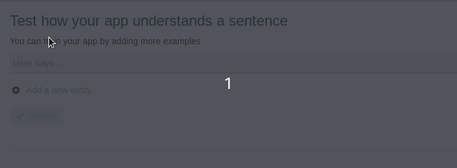
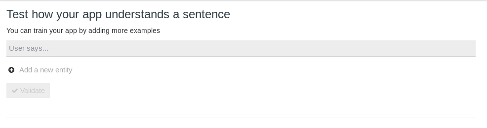
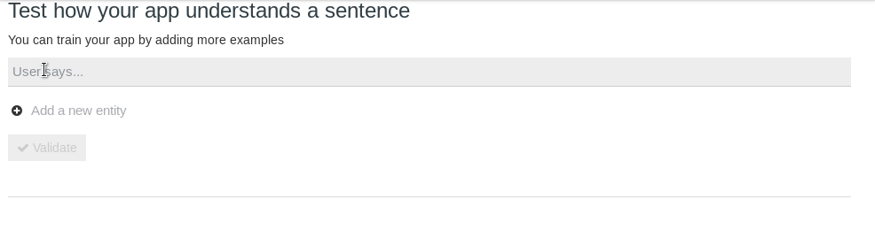
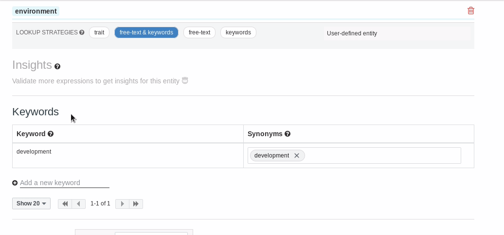
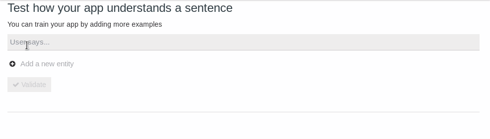

# Chatops 101

## with opsdroid

Note:
Preguntar gente en la sala chatops, montado, opsdroid.
Mini presentación.

-> Explicar palabro

---

## What the f#!@ is chatops?

> ChatOps is the use of chat clients, chat-bots and real-time communication tools to facilitate how software development and operation tasks are communicated and executed.

_Abhinav Jain, works at Accenture and sometimes answers questions like this on Quora._

<!-- .element: class="small-text" -->

Note:
Conjunción de Chat y Operaciones.
Integrar procesos de desarrollo y operaciones en las herramientas de chat del equipo.
Integración de un robot en Slack que colabora con el equipo.
puede hacer deploys, reiniciar cosas, hacer backups, hasta donde nos llegue la imaginación.

-> Tenemos el primer palabro, nos falta el siguiente.

---

## So here is opsdroid


Opsdroid is an open source ChatOps bot framework with the moto:
**Automate boring things!**

Note:
-> Hay muchos más, entonces por que Opsdroid?

---

## But why Opsdroid?

**Simple**: Easy to install, configure and deploy.

<!-- .element: class="fragment fade-in-then-semi-out" -->

**Powerful**: Works out of the box with Slack, Telegram, Facebook… and with various NLU platforms.

<!-- .element: class="fragment fade-in-then-semi-out" -->

**Extensible**: Add your custom skills in few Python lines.

<!-- .element: class="fragment fade-in-then-semi-out" -->

Note:
Simple: docker, o simple pip install, un solo yaml de config
Potente: se conecta con muchos servicios (baterias incluidas)
Extensible: adaptarlo a nuestro caso de uso de forma sencilla

-> Y esto como?

---

## Show me more

### Let's see how Opsdroid works

Note:
Objetivo de la charla no es explicar en profundidad.
Dar unas pinceladas sobre su diseño y uso.
Simple, gusanillo, llegar a casa, docu, y en 1 hora POC.
Si conoceis Chatops, otra herramienta

-> Para ello vamos a hablar de las diferentes piezas que lo componen

---

## Skills

Skills are modules which define what actions opsdroid should perform based on different chat messages.

They’re modular and can be shared as plugins between differents opsdroid instances.

Note:
Las skills son el "qué" hace.
Algunas oficiales ya hechas que se pueden usar: saludar, loud, seen.
Son plugins, puedes hacerte los tuyos (publicos o privados)

-> Veamos a que me refiero cuando digo sencillo

---

## Skills

```python
class HelloSkill(Skill):

  @match_regex(r'hi|hello|hey|hallo')
  async def hello(self, message: Message):
    text = random.choice(
      ["Hi {}", "Hello {}", "Hey {}"]
    ).format(message.user)
    await message.respond(text)

  @match_regex(r'bye( bye)?|see y(a|ou)|au revoir|I(\')?M off')
  async def goodbye(self, message: Message):
    text = random.choice(
      ["Bye {}", "See you {}", "Au revoir {}"]
    ).format(message.user)
    await message.respond(text)
```

Note:
Una clase que hereda de Skill (de opsdroid)
Cada classe skill puede tener varias funciones para interactuar
Tienen un decorador para ver cuando ejecutarse
Las funciones reciben el mensaje y pueden actuar según eso.
A partir de aquí es Python (llamar a jenkins, AWS, etc.)

-> Hablemos del como se ejecutan, entremos en los decoradores

---

## Parsers

Parsers match an incoming message to a skill.

Actual parsers:
_Regex, Parse_Format, Crontab, Webhook, Always and NLU parsers_

Note:
Relacionan un mensaje con una skill.
Mensaje pasa por todos los parsers y mejor puntuación.
Hay bastantes parsers actualmente (a parte de que podriamos crear los nuestros)

-> Veamos algunos ejemplos

---

## Parsers

```python
class MyNameSkill(Skill):

  @match_regex(r'my name is (?P<name>\w+)')
  async def my_name_is(self, message: Message):
    name = message.regex.group('name')
    await message.respond(f'Wow, {name} is a nice name!')
```

<!-- .element: class="fragment fade-in-then-semi-out" -->

```python
class MyNameSkill(Skill):

  @match_parse('my name is {name}')
  async def my_name_is(self, message: Message):
    name = message.parse_result['name']
    await message.respond(f'Wow, {name} is a nice name!')
```

<!-- .element: class="fragment fade-in-then-semi-out" -->

Note:
Volvemos a ver el regex, viendo que podemos usar grupos de captura.
Parse hace lo mismo pero mucho más sencillo (menos potente)

---

## Parsers

```python
class ClockSkill(Skill):

    @match_crontab('0 * * * *')
    @match_regex(r'what time is it\?')
    async def speaking_clock(self, message: Message):
      connector = self.opsdroid.default_connector
      default_room = connector.default_room

      if message is None:
        message = Message('', None, default_room, connector)

      await message.respond(strftime("It's %H:%M", gmtime()))
```

Note:
Podemos tener más de un parse para la misma función de skill

---

## Connectors

Connectors are modules for connecting opsdroid to your specific chat service.

Actual connectors:
_Shell, Websocket, Slack, Telegram, Twitter, Facebook, Github, Ciscospark and Matrix_

Note:
Por donde opsdroid habla y escucha.

---

## Config

```yaml
parsers:
  - name: witai
    enabled: true
    access-token: "mysecretwittoken"
    min-score: 0.7

connectors:
  - name: slack
    token: "mysecretslacktoken"

skills:
  - name: hello
  - name: myawesomeskill
    repo: "https://github.com/username/myawesoneskill.git"
```

Note:

Recordad luego el min-score
Podriamos añadir BBDD (no hace falta)
Diferentes conectores a la vez
Skills oficiales y propias
Constraints siempre activas

---

## Yeah, but...

### You said something about NLU?

---

## What the heck is NLU?

> Natural language understanding (NLU) is a branch of artificial intelligence (AI) that uses computer software to understand input made in the form of sentences in text or speech format.

_Margaret Rouse in WhatIs.com_

<!-- .element: class="small-text" -->

Note:
Rama de la inteligencia artifical con el proposito entiende una frases de usuarios.
Lo podriamos programar nosotros, o podemos usar servicios que nos lo dan hecho.

---

## NLU parsers

Opsdroid connects with some NLU services:

- **Wit.ai** (Facebook service)
- **Dialogflow** (Google service)
- **Luis.AI** (Microsoft service)
- **Recast.AI** (SAP service)
- **Rasa** (Open Source)

Note:
APIs gratiutas en precio (no en datos)
Rasa además de libre es Python

-> Todas son parecidas, la que más he mirado es Wit

---

## Wit.AI example


Note:
Necesito una cita de 30 minutos mañana a las 7.
Intención, entidades, entrenamiento

-> Veamos un ejemplo más cercano al caso de uso que buscamos (reiniciar)

---

#### Wit.AI restart example



Note:
Creando un intent (no asociado a ninguna palabra en concreto)

---

#### Wit.AI restart example


Note:
Autocompleta el intent

---

#### Wit.AI restart example


Note:
Corregir y enseñar

---

#### Wit.AI restart example



Note:
Autocompleta con restart

---

#### Wit.AI restart example



Note:
Creando una entidad personalizada (environment)

---

#### Wit.AI restart example



Note:
Personalizando entidades (keywords, alias)

---

#### Wit.AI restart example



Note:
Entendiendo por keyword (ejemplo real)

---

## Wit.AI API example

A message "_restart production, please!_" is sent to Wit.ai

```json
{
  "_text": "restart production, please!",
  "entities": {
    "intent": [
      {
        "confidence": 0.98,
        "value": "restart"
      }
    ],
    "environment": [
      {
        "confidence": 1,
        "value": "production",
        "type": "value"
      }
    ]
  }
}
```

Note:
Respuesta de la API

-> ¿Como opsdroid entiende esto?

---

## Wit.AI code example

```python
class RestartSkill(Skill):

  @match_witai('restart')
  async def restart(self, message: Message):
    entities = message.witai['entities']
    environments = entities['environment']
    if not environments:
      await message.respond('Please specify an environment.')
      return

    environment = environments['0']['value']
    await _do_restart(environment)
    await message.respond(f'{environment} restarted!')
```

Note:
Parser especial para WitAi (los hay para los demás servicios también)
do_restart podria ser código que llama a Jenkins.

---

## Sounds cool, doesn't it?

Note:
Como empezo todo, restart de legacy

---

# Thanks! 🤗

### Any questions?

I am Àngel, a.k.a. [@anxodio](https://twitter.com/anxodio)

_Python Developer / Data Engineer at [@HolaluzEng](https://twitter.com/holaluzeng)_

 is looking for great people like you, join us! [holaluz.com/jobs](http://holaluz.com/jobs)

<!-- .element: class="small-text holaluz-jobs" -->

Note:
En Holaluz tenemos posiciones abiertas de prácticamente todo (Python, PHP, Java)
De hecho buscamos personas que valgan la pena, no sólo expertos en X tecnologia
Es un buen sitio para trabajar, si alguien quiere comentarlo que me busque luego
